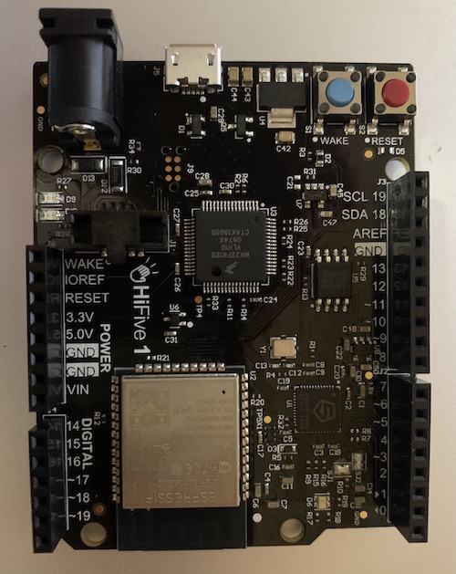

# Experiments with Mecrisp Forth on Risc V

## Intent

To document setting up and usage of [Mecrisp Quintus](https://mecrisp-stellaris-folkdoc.sourceforge.io/gd32vf103.html), an experimental forth for Risc V microprocessors.

## Introduction

Forth on modern embedded processors has seen some developments for FPGA's, Arm, Risc V, ESP 32 and so on.
These are often, but not always, used on hobbyist single board computers based on the Arduino form factor.
Risc V is one of these microprocessors/microcomputers that come in 32 and 64 bit variants. 
This document will test the state of development of one forth, [Mecrisp Quintus](https://mecrisp-stellaris-folkdoc.sourceforge.io/gd32vf103.html), out of 3 such Forth distributions.

## Development Environment

For development a Linux environment seems to be preferred, 
so this is setup in a docker container. 
This is only needed if new binaries are required.
The basic distribution comes with pre-assembled binaries as .hex and .bin files.

### Debian in a Docker Container hosted on MacOS.

Download the [code](https://sourceforge.net/projects/mecrisp/files/mecrisp-quintus-0.29-experimental.tar.gz/download) (or later version) into directory /Users/<user-name-here-0>/development/mecrisp. Unpack the archive file.

Start the container in detached mode and assign a pseudo tty to keep the container running:

```bash
docker run \
    --name forth-dev \
    -h forth-host \
    -v /host_mnt/Users/richardrothwell/development/mecrisp:/home/richard/src \
    -e LANG=C.UTF-8 \
    -dt debian
```
Login to the container:

```bash
docker ps
# Replace 4cc below with whatever the container ID is revealed by the ps sub-command.
docker exec -it 4cc /bin/bash
```

On the container update and install the dependencies (this is the root user so sudo is not needed):

```bash
# Verify the files on the host can be seen.
ls /home/richard/src/
# Enter the relevant directory and check the README file.
cd /home/richard/src/mecrisp-quintus-0.29-experimental
cat README | more
apt-get update
apt-get install binutils-riscv64-linux-gnu binutils-mipsel-linux-gnu qemu-user-static srecord
# Ignore irrelevant warnings following: mount: /proc/sys/fs/binfmt_misc: permission denied
apt-get install make
# The Risc V processor SBC to be targeted is the hifive1B. 
# All the others supported are shown in the assemble script file.
cat README | assemble
./assemble hifive1B
# List the files to see if they have been updated.
# The mecrisp-quintus-hifive1B.bin and mecrisp-quintus-hifive1B.hex should have their creation dates rrfreshed.
ls -al

```
## Deployment

### HiFive1 Rev B


## Resources

| *Resource* | *Link* |
| ---------- | ----- |
| Platforms | [All Mecrisp Forth Supported Platforms](http://mecrisp.sourceforge.net) |
| Download |  [Mecrisp Sources](https://sourceforge.net/projects/mecrisp/) |
| Forth Glossary |  [Mecrisp Forth Glossary](https://mecrisp-stellaris-folkdoc.sourceforge.io/gd32vf103.html) |
| Documentation |  [Mecrisp Unofficial Documentation: GD32VF103](https://mecrisp-stellaris-folkdoc.sourceforge.io/gd32vf103.html) |
| Forum | [Mecrisp Forum](https://sourceforge.net/p/mecrisp/discussion/general/) |
| Discussions | [Discussion 1](https://sourceforge.net/p/mecrisp/discussion/general/thread/3a0c2e6e3f/) |
| Flashing chip | [Flashing Mecrisp Stellaris](https://mecrisp-stellaris-folkdoc.sourceforge.io/flashing-mecrisp_stellaris.html)
| Flashing chip| [HiFive1 Rev B Getting Started Guide](https://sifive.cdn.prismic.io/sifive%2F8d7b8385-64e3-4914-8608-8568412c8aae_hifive1b-getting-started-guide.pdf) |
